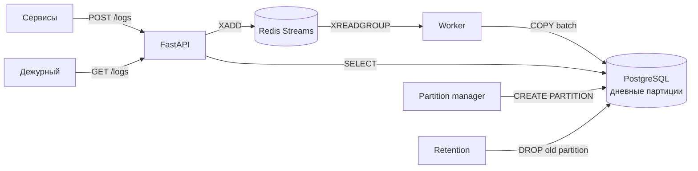

# Log Aggregation Service

Сервис приёма и поиска логов на FastAPI, Redis Streams и PostgreSQL. HTTP-обработчик только валидирует запись и помещает её в очередь. Отдельный worker читает Redis Stream и пакетами записывает логи в PostgreSQL, разбитый на дневные партиции.

## Возможности

- `POST /logs` принимает одну запись или массив до 1000 записей и возвращает `202 Accepted` после успешной записи в Redis;
- worker сохраняет логи в PostgreSQL пакетами через `asyncpg COPY`;
- `GET /logs` фильтрует по сервису, уровню и временному диапазону;
- cursor pagination без `OFFSET`, максимальный `limit` — 1000;
- дневные UTC-партиции создаются заранее;
- retention удаляет партиции старше семи дней через `DROP TABLE`;
- генератор наполняет базу до 5 000 000 записей за последние семь дней;
- интеграционные тесты используют настоящие PostgreSQL и Redis;
- нагрузочный тест проверяет 1000 логов/с и p95 поиска.

## Архитектура



Путь записи отделён от пути чтения. Медленная запись в PostgreSQL не удерживает HTTP-запрос: API подтверждает приём после помещения сообщения в Redis, а worker обрабатывает очередь независимо.

## Стек

- Python 3.12;
- FastAPI и Pydantic v2;
- PostgreSQL 16 и `asyncpg`;
- Redis 7 Streams;
- pytest и pytest-asyncio;
- Docker Compose.

## Быстрый запуск

Создать локальную конфигурацию и заменить пароль:

```bash
cp .env.example .env
```

Запустить основной стек:

```bash
docker compose up -d --build
```

Проверить зависимости API:

```bash
curl http://localhost:8000/health
```

Доступные адреса:

- API: <http://localhost:8000>;
- Swagger UI: <http://localhost:8000/docs>;
- Adminer: <http://localhost:8080> — сервер `postgres`, остальные значения берутся из `.env`.

Обычный `docker compose up` не запускает генератор, тесты и нагрузку: они вынесены в отдельные Compose-профили.

## Инициализация и миграции

При первом создании PostgreSQL volume файл `init.sql` автоматически создаёт таблицу, дневные партиции и поисковый индекс.

Для существующего volume миграция индекса применяется одной командой:

```bash
docker compose exec -T postgres sh -c 'psql -U "$POSTGRES_USER" -d "$POSTGRES_DB"' < migrations/001_add_logs_search_index.sql
```

Миграция идемпотентна благодаря `CREATE INDEX IF NOT EXISTS`.

## Наполнение базы

Генератор создаёт случайные логи за последние семь дней пакетами по 5000 через `COPY`. Если часть данных уже существует, он добавляет только недостающее количество до `SEED_TOTAL`.

```bash
docker compose --profile generator run --rm --build generator
```

По умолчанию `SEED_TOTAL=5000000` и `SEED_BATCH_SIZE=5000`.

## API

### POST /logs

Одна запись:

```bash
curl -X POST http://localhost:8000/logs \
  -H 'Content-Type: application/json' \
  -d '{
    "service": "payments",
    "timestamp": "2026-10-04T10:00:00Z",
    "level": "ERROR",
    "message": "Payment provider timeout"
  }'
```

Пакет передаётся JSON-массивом из 1–1000 таких объектов. Успешный ответ:

```json
{
  "accepted": 1
}
```

`timestamp` обязан содержать часовой пояс. Допустимые уровни: `DEBUG`, `INFO`, `WARNING`, `ERROR`, `CRITICAL`. Неизвестные поля запрещены.

### GET /logs

```bash
curl --get http://localhost:8000/logs \
  --data-urlencode 'service=payments' \
  --data-urlencode 'level=ERROR' \
  --data-urlencode 'from=2026-10-04T00:00:00Z' \
  --data-urlencode 'to=2026-10-05T00:00:00Z' \
  --data-urlencode 'limit=100'
```

Параметры:

- `service` и `level` — опциональные фильтры;
- `from` включается в диапазон, `to` не включается;
- `limit` — от 1 до 1000, по умолчанию 100;
- `cursor` — значение `next_cursor` предыдущей страницы.

Ответ:

```json
{
  "items": [],
  "next_cursor": null
}
```

Записи сортируются по `(timestamp, id) DESC`. `id` разрешает коллизии одинаковых timestamp и делает порядок стабильным. Cursor хранит оба значения, и следующая страница использует условие:

```sql
(timestamp, id) < (:cursor_timestamp, :cursor_id)
```

Более новые записи, добавленные после первой страницы, не сдвигают уже начатый обход. При новом запросе без cursor они сразу становятся видны.

## Схема и партиционирование

```sql
CREATE TABLE logs (
    id BIGINT GENERATED ALWAYS AS IDENTITY,
    service TEXT NOT NULL,
    timestamp TIMESTAMPTZ NOT NULL,
    level TEXT NOT NULL,
    message TEXT NOT NULL,
    PRIMARY KEY (timestamp, id)
) PARTITION BY RANGE (timestamp);
```

Партиции имеют имя `logs_YYYYMMDD` и UTC-границы `[начало дня, начало следующего дня)`.

Сервис `partition-manager` при старте и далее раз в сутки идемпотентно проверяет партиции на сегодня и завтра. Advisory lock не позволяет двум экземплярам одновременно создавать одну партицию.

Сервис `retention` раз в час находит партиции старше семи дней и удаляет их через `DROP TABLE`. Установлен `lock_timeout=2s`: занятая партиция пропускается до следующего запуска, поэтому обслуживание не ждёт блокировку бесконечно.

## Очередь и гарантии worker

Worker использует Redis consumer group:

1. `XREADGROUP` выдаёт сообщения worker;
2. записи сохраняются в PostgreSQL одной транзакцией через `COPY`;
3. после успешного commit выполняются `XACK` и `XDEL`;
4. при перезапуске worker сначала обрабатывает свои pending-сообщения.

Семантика — at-least-once. Если PostgreSQL commit прошёл, а worker завершился до `XACK`, сообщение будет обработано повторно. Для строгой идемпотентности в модель потребуется добавить внешний `event_id` и уникальное ограничение.

## Индекс поиска

```sql
CREATE INDEX logs_service_level_timestamp_id_idx
ON logs (service, level, timestamp DESC, id DESC);
```

`service` и `level` стоят первыми, потому что по ним выполняется равенство. `timestamp` задаёт диапазон суток и порядок, а `id` продолжает порядок для cursor pagination. Поле `message` не включено: крупный текст заметно увеличил бы индекс и стоимость вставки.

Индекс оптимизирован под критерий задания — одновременный фильтр по сервису, уровню и суткам. Для запросов только по `level` он не является универсальным решением; добавлять отдельный индекс без фактической нагрузки не стал, чтобы не увеличивать стоимость записи.

## Тесты

Запуск одной командой:

```bash
docker compose --profile test run --rm --build tests
```

Текущий набор содержит четыре интеграционных теста:

- retention удаляет только партиции старше семи дней;
- partition manager создаёт сегодня и завтра и остаётся идемпотентным;
- worker читает настоящий Redis Stream, пишет в PostgreSQL и выполняет `XACK`;
- cursor pagination не теряет и не дублирует исходные записи при вставке между страницами.

Тесты создают уникальные схемы, Stream или service и очищают данные в `finally`. Результат последнего запуска:

```text
4 passed in 0.56s
```

## Нагрузочный тест

Перед замером база должна содержать минимум 5 000 000 строк. Сервис запускается одним процессом Uvicorn без `--reload` и одним worker.

```bash
docker compose --profile load run --rm --build load-test
```

Сценарий:

1. проверяет объём базы и доступность API, Redis и PostgreSQL;
2. выполняет 10 секунд прогрева с полной нагрузкой;
3. в течение 60 секунд отправляет 1000 логов/с — 10 POST/с пакетами по 100;
4. параллельно выполняет 20 GET/с с фильтрами по сервису, уровню и суткам;
5. считает перцентили и задержку самого генератора;
6. ждёт опустошения Redis Stream;
7. сверяет количество записей запуска в PostgreSQL.

Условия замера 4 октября 2026 года:

- Docker Desktop `aarch64`, 8 CPU, 7.7 GiB RAM;
- один процесс API и один worker;
- 5+ млн строк в PostgreSQL;
- одинаковые параметры до и после индекса.

| Метрика | До индекса | После индекса |
|---|---:|---:|
| Строк в базе перед тестом | 5 000 700 | 5 071 000 |
| Принято логов | 60 000 / 60 000 | 60 000 / 60 000 |
| Ошибки | 0 | 0 |
| POST p95 | 10.5 ms | 13.4 ms |
| GET p95 | 14.7 ms | 12.6 ms |
| Максимальное время GET | 103.7 ms | 83.9 ms |
| Redis Stream после теста | 0 | 0 |
| Записано с учётом прогрева | 70 000 / 70 000 | 70 000 / 70 000 |

Критерии `1000 логов/с в течение минуты без ошибок` и `GET p95 < 300 ms` выполнены до и после индекса.

## Оптимизация: EXPLAIN до и после

Измерялся запрос `GET /logs` с `service=payments`, `level=ERROR`, диапазоном одних UTC-суток, сортировкой `(timestamp, id) DESC` и `LIMIT 101`. Перед каждым замером запрос выполнялся один раз для прогрева.

До составного индекса PostgreSQL шёл назад по PK `(timestamp, id)`, а `service` и `level` проверял после чтения. Для получения 101 строки пришлось отбросить 72 190 строк.

| Метрика SQL | До | После |
|---|---:|---:|
| Execution Time | 21.202 ms | 0.306 ms |
| Shared buffers | 2 982 | 104 |
| Rows Removed by Filter | 72 190 | 0 |

SQL стал примерно в 69 раз быстрее и использовал примерно в 29 раз меньше буферов. HTTP p95 изменился слабее, потому что включает сеть, FastAPI, получение соединения и сериализацию.

Полные планы: [до индекса](explain/search_before.txt) и [после индекса](explain/search_after.txt).

### Цена индекса на вставке

Отдельный benchmark выполняет `COPY` 100 000 строк пакетами по 1000: один прогревочный и три измеряемых запуска, после каждого транзакция откатывается.

```bash
docker compose --profile load run --rm --build insert-benchmark
```

| Метрика | До | После |
|---|---:|---:|
| COPY 100 000 строк | 0.415 s | 0.723 s |
| Пропускная способность | 241 006 строк/с | 138 297 строк/с |
| Размер поискового индекса | — | 279 MB |

Пропускная способность COPY снизилась примерно на 42.6%, но осталась намного выше целевых 1000 логов/с. Для сравнения, суммарный размер PK-индексов — 230 MB.

Построение индекса на заполненной базе заняло 6.0 секунды. Обычный `CREATE INDEX` может блокировать запись. Для production-миграции дочерние индексы следует создавать поочерёдно через `CREATE INDEX CONCURRENTLY`, после чего присоединять к партиционированному индексу.

## Ответы на вопросы задания

### Почему OFFSET плох на глубоких страницах?

`OFFSET N` не умеет начать чтение с N-й строки: PostgreSQL должен найти, проверить и отбросить все предыдущие строки. Стоимость растёт вместе с номером страницы. При конкурентной вставке новая запись в начале результата сдвигает позиции: следующая OFFSET-страница может повторить последнюю запись предыдущей страницы или пропустить другую.

На 9 328 подходящих строках сравнивались `OFFSET 8000 LIMIT 100` и cursor-запрос той же страницы:

| Метрика | OFFSET 8000 | Cursor |
|---|---:|---:|
| Execution Time | 6.261 ms | 0.181 ms |
| Shared buffers | 1 200 | 104 |
| Просмотрено подходящих строк | 9 328 | 100 |

Cursor оказался примерно в 35 раз быстрее. Полные планы: [OFFSET](explain/pagination_offset.txt) и [cursor](explain/pagination_cursor.txt).

### Какие индексы созданы и чем заплачено?

Первичный ключ `(timestamp, id)` обеспечивает уникальность и порядок общей cursor pagination. Индекс `(service, level, timestamp DESC, id DESC)` обслуживает фактический поисковый запрос с двумя равенствами, диапазоном суток и сортировкой.

Цена второго B-tree: COPY throughput снизился с 241 006 до 138 297 строк/с, а индекс занял 279 MB.

### Почему DELETE для retention — плохой способ?

`DELETE` обрабатывает каждую строку отдельно: пишет WAL, создаёт мёртвые версии строк по MVCC, увеличивает размер таблицы и индексов и оставляет работу для VACUUM. На миллионах строк операция длительная и конкурирует с обычными запросами.

Дневная партиция уже соответствует единице retention. `DROP TABLE` удаляет её целиком как объект и не сканирует каждую запись. Короткая блокировка всё равно нужна, поэтому retention использует небольшой `lock_timeout` и повторяет попытку позже.

## Принятые решения

| Решение | Почему | Цена / альтернатива |
|---|---|---|
| Redis Streams | consumer groups, pending и явный `XACK` | сложнее Redis List; нужна политика recovery |
| `asyncpg` без ORM | прямой контроль SQL и быстрый `COPY` | SQL и преобразования описываются вручную |
| Пакеты по 1000 | меньше round-trip и транзакций | сообщение подтверждается только после всей пачки |
| Cursor pagination | стабильная стоимость и отсутствие сдвига от новых записей | cursor непрозрачен, нельзя перейти сразу на произвольную страницу |
| Дневные партиции | pruning по суткам и дешёвый retention | нужно заранее создавать будущие партиции |
| `DROP` вместо `DELETE` | нет миллионов row-level операций и table bloat | запрос к удаляемой партиции может кратко удерживать блокировку |
| Собственный Python load test | тот же стек, фиксированный arrival rate и проверка Redis/БД | меньше готовых отчётов, чем у k6 или Locust |

## Поведение при отказах и ограничения

- если Redis недоступен, `POST /logs` возвращает `503`, а не ложный `202`;
- health endpoint проверяет Redis и PostgreSQL;
- Compose перезапускает упавший worker;
- окно между PostgreSQL commit и `XACK` допускает повторную запись;
- текущий recovery рассчитан на перезапуск consumer с тем же именем; для горизонтального масштабирования нужен уникальный consumer name и `XAUTOCLAIM` чужих pending-сообщений;
- повреждённое сообщение может вызвать цикл падений — production-версия потребует dead-letter stream;
- полнотекстовый поиск и постоянные метрики не реализованы, так как указаны в необязательной части задания;
- автоматизированного HTTP end-to-end теста в pytest пока нет, но HTTP → Redis → worker → PostgreSQL проверяется нагрузочным сценарием;
- аутентификация отсутствует, поскольку не входит в требования.

## Структура проекта

```text
main.py                 FastAPI: POST /logs и GET /logs
worker.py               Redis consumer и пакетная запись
generator.py            наполнение до 5 млн строк
partition_manager.py    создание будущих партиций
retention.py            удаление старых партиций
load_test.py            HTTP-нагрузочный тест
insert_benchmark.py     измерение стоимости индекса
init.sql                начальная схема
migrations/             изменения существующей базы
explain/                планы запросов до и после
tests/                  интеграционные тесты
docker-compose.yml      сервисы и отдельные профили
```
